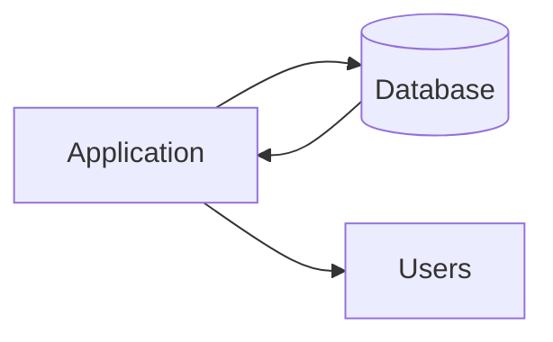
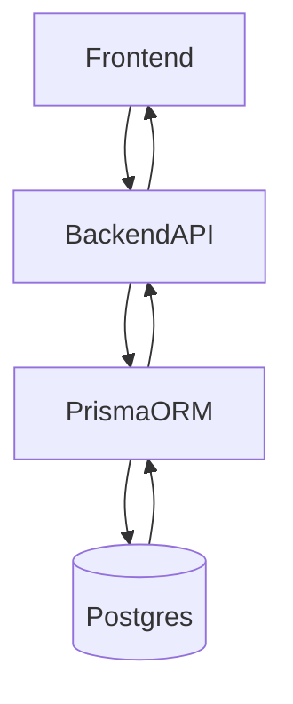

# Lesson 1: Introduction to Databases (Long-form Enhanced)

> Databases are the “source of truth” for most applications. This lesson builds a practical mental model of what a database does, why relational databases are so common, and how Prisma fits into the picture.

## Table of Contents

- What databases are (engine vs data)
- Relational database mental model (tables, keys, relationships)
- ACID (high-level, practical meaning)
- Database vs ORM (where Prisma fits)
- Best practices, pitfalls, troubleshooting
- Advanced patterns (preview): transactions, migrations, performance

## Learning Objectives

By the end of this lesson, you will be able to:
- Explain what a database is and why applications use databases
- Describe what makes a database “relational”
- Define core database terms (table, row, column, primary key, foreign key)
- Explain what ACID means at a high level
- Understand how a database relates to an ORM like Prisma

## Why Databases Matter

Most real applications need data that is:
- persistent (survives restarts)
- shared (multiple users/devices)
- queryable (search, filter, sort, aggregate)

A database provides those guarantees and tools.

## What is a Database?

A database is an organized collection of data stored and accessed electronically.

In practice, it is both:
- the data store (files on disk)
- the database engine (software that manages reads/writes, concurrency, indexes, etc.)

## Relational Databases (RDBMS)

PostgreSQL is a relational database management system (RDBMS):
- data stored in **tables**
- tables have **rows** and **columns**
- **relationships** connect tables (foreign keys)
- transactions + ACID properties for correctness

### A simple mental model

Think of tables as spreadsheets, but with:
- strict types and constraints
- relationships between tables
- concurrency control for many users at once

## Key Concepts

- **Table**: a collection of related records (e.g., `users`)
- **Row**: one record in a table (e.g., a specific user)
- **Column**: one field in a row (e.g., `email`)
- **Primary Key (PK)**: unique identifier for each row
- **Foreign Key (FK)**: reference from one table to another

## ACID (High-Level)

ACID describes properties of transactions:
- **Atomicity**: all-or-nothing changes
- **Consistency**: constraints remain valid
- **Isolation**: concurrent transactions don’t corrupt each other
- **Durability**: committed data survives crashes

You don’t need to memorize the definition—just remember: ACID is why relational databases are reliable under real-world concurrency.

## Why PostgreSQL?

- open source and free
- strong correctness guarantees (ACID)
- supports complex queries and indexing strategies
- scales from small apps to large systems
- strong ecosystem and community

## Database vs ORM

- **Database**: PostgreSQL stores and retrieves data
- **ORM**: Prisma provides type-safe access and migrations

### Why use an ORM at all?

It can:
- reduce repetitive SQL boilerplate
- provide types and safer refactors
- standardize migration workflows

But knowing database fundamentals remains essential for performance and correctness.

## Real-World Scenario: A Full-Stack App Data Flow

## Best Practices

### 1) Design data intentionally

Bad schemas create long-term pain. Think about:
- what entities exist
- how they relate
- how you’ll query them

### 2) Use constraints to protect your data

Constraints (unique, not null, FK) prevent invalid states.

### 3) Learn SQL basics even if you use Prisma

Understanding SQL helps you reason about performance and debugging.

## Common Pitfalls and Solutions

### Pitfall 1: Treating the database like a “dumb JSON store”

**Problem:** you ignore relational modeling and constraints.

**Solution:** use tables, relationships, and constraints to reflect reality.

### Pitfall 2: Over-abstracting with ORM

**Problem:** you don’t understand what queries run, leading to slow endpoints.

**Solution:** learn SQL basics and inspect generated queries when needed.

## Troubleshooting

### Issue: “My app is slow”

**Symptoms:**
- list pages take a long time

**Solutions:**
1. Check if queries scan large tables without indexes.
2. Limit results and paginate.
3. Use indexes (covered later).

## Advanced Patterns (Preview)

These topics are intentionally *not required* yet, but you should know they exist:

### 1) Transactions and isolation levels (concept)

ACID is the “promise”; isolation levels are the knobs that control *how* concurrency behaves in edge cases.
You’ll usually rely on Postgres defaults until you have a specific correctness need (e.g., financial ledgers).

### 2) Schema evolution and migration discipline

Real systems change. Migrations help you ship schema changes safely across environments (dev → staging → prod).

### 3) Performance as a design constraint

Indexes, query plans (`EXPLAIN`), and pagination patterns matter as data grows.
ORMs help productivity, but they don’t remove the need to understand what the database is doing.

## Next Steps

Now that you understand what databases are:

1. ✅ **Practice**: Identify entities for a simple blog (users, posts, comments)
2. ✅ **Experiment**: Decide what keys and relationships you need
3. 📖 **Next Lesson**: Learn about [Relational Concepts](./lesson-02-relational-concepts.md)
4. 💻 **Complete Exercises**: Work through [Exercises 01](./exercises-01.md)

## Additional Resources

- [PostgreSQL Documentation](https://www.postgresql.org/docs/)
- [Prisma Documentation](https://www.prisma.io/docs)

---

**Key Takeaways:**
- Databases provide persistence, concurrency, and powerful querying.
- Relational databases store data in tables with relationships and constraints.
- ACID transactions are core to correctness under concurrency.
- ORMs help, but fundamentals still matter for real-world performance and safety.
