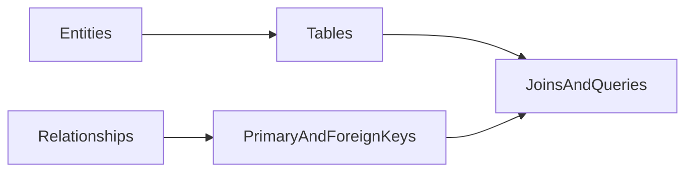

# Lesson 2: Relational Concepts (Long-form Enhanced)

> Relational modeling is how you prevent “data chaos” as an app grows: you define entities, enforce constraints, and connect tables through foreign keys so the database can protect correctness for you.

## Table of Contents

- Entities, tables, and keys (PK/FK)
- Relationship types (1..n, 1..1, n..n)
- Normalization trade-offs (practical)
- Real-world modeling: a blog
- Best practices, pitfalls, troubleshooting
- Advanced patterns (preview): explicit join tables, cascade/soft delete, denormalization

## Learning Objectives

By the end of this lesson, you will be able to:
- Explain how tables represent entities and relationships represent connections
- Understand primary keys (PK) and foreign keys (FK) and why they matter
- Model one-to-many, one-to-one, and many-to-many relationships
- Recognize normalization trade-offs (avoid duplication vs practical simplicity)
- Understand how Prisma models map onto relational concepts

## Why Relational Modeling Matters

Relational modeling is how you keep data:
- consistent (constraints prevent invalid states)
- queryable (joins and indexes work well)
- maintainable (changes don’t require rewriting everything)



## Tables and Relationships

Relational databases organize data into tables with relationships:

```text
Users Table          Posts Table
---------            ----------
id (PK)              id (PK)
email                title
name                 userId (FK) → Users.id
```

### Key idea

`Posts.userId` points to `Users.id`. That’s how the database knows which user owns which post.

## Relationship Types

### One-to-Many

One user has many posts.

In Prisma:

```prisma
model User {
  id    Int    @id @default(autoincrement())
  posts Post[]
}

model Post {
  id     Int  @id @default(autoincrement())
  userId Int
  user   User @relation(fields: [userId], references: [id])
}
```

In SQL terms:
- `posts.userId` is the foreign key
- `users.id` is the referenced primary key

### One-to-One

One user has one profile (optional).

```prisma
model User {
  id      Int     @id @default(autoincrement())
  profile Profile?
}

model Profile {
  id     Int  @id @default(autoincrement())
  userId Int  @unique
  user   User @relation(fields: [userId], references: [id])
}
```

The `@unique` on `Profile.userId` enforces “at most one profile per user”.

### Many-to-Many

Users can have many roles; roles can have many users.

In Prisma, a simple many-to-many can be modeled as:

```prisma
model User {
  id    Int    @id @default(autoincrement())
  roles Role[]
}

model Role {
  id    Int    @id @default(autoincrement())
  users User[]
}
```

Behind the scenes, many-to-many typically uses a join table.
In more advanced designs, you often model the join table explicitly (e.g., `UserRole`) when you need extra fields like `createdAt`.

## Normalization (Practical)

Normalization aims to reduce duplication.

Example:
- don’t store user email on every post row
- store a `userId` and join when needed

Trade-off:
- normalization improves consistency
- denormalization can improve read performance in some cases (but increases risk of inconsistency)

## Real-World Scenario: Modeling a Blog

Entities:
- users
- posts
- comments

Relationships:
- user 1..n posts
- post 1..n comments
- user 1..n comments

## Best Practices

### 1) Use foreign keys for integrity

FK constraints prevent orphaned records.

### 2) Keep relationships explicit

Clear relationship modeling reduces application bugs and makes queries simpler.

### 3) Prefer explicit join tables when you need metadata

If the relationship itself has meaning (role assignment date), model it explicitly.

## Common Pitfalls and Solutions

### Pitfall 1: Duplicating data everywhere

**Problem:** copying user fields into other tables causes inconsistencies.

**Solution:** use foreign keys and joins; only denormalize intentionally.

### Pitfall 2: Missing uniqueness in one-to-one

**Problem:** “one-to-one” becomes “one-to-many” accidentally.

**Solution:** add a `@unique` constraint on the FK side.

### Pitfall 3: Confusing many-to-many needs

**Problem:** you later need metadata on the relationship but didn’t model it.

**Solution:** use an explicit join table for flexible designs.

## Troubleshooting

### Issue: Deletes fail due to foreign key constraints

**Symptoms:**
- you can’t delete a user because posts reference them

**Solutions:**
1. Decide on delete behavior: restrict, cascade, or soft-delete.
2. Implement consistent rules across the app.

## Advanced Patterns (Preview)

### 1) Explicit join tables for “relationship metadata”

If the relationship itself has attributes (e.g., `assignedAt`, `assignedBy`, `roleSource`), model the join table explicitly:
- `UserRole` with `(userId, roleId)` and extra fields

### 2) Cascading rules and soft deletes

In real systems you’ll decide between:
- **restrict** deletes (safest)
- **cascade** deletes (convenient but risky)
- **soft delete** (keep record, mark as deleted)

The “right” choice depends on your product and compliance requirements.

### 3) Denormalization (intentional)

Sometimes you duplicate data *on purpose* for read performance (caches/materialized views).
The key is to do it intentionally and know how you keep it consistent.

## Next Steps

Now that you understand relational concepts:

1. ✅ **Practice**: Model a “teams and members” system (many-to-many)
2. ✅ **Experiment**: Decide when to use explicit join tables
3. 📖 **Next Level**: Move into Prisma basics and schema definition
4. 💻 **Complete Exercises**: Work through [Exercises 01](./exercises-01.md)

## Additional Resources

- [PostgreSQL: Constraints](https://www.postgresql.org/docs/current/ddl-constraints.html)
- [Prisma: Relations](https://www.prisma.io/docs/concepts/components/prisma-schema/relations)

---

**Key Takeaways:**
- Relationships connect tables via foreign keys.
- One-to-many and one-to-one differ mainly by uniqueness constraints.
- Many-to-many usually requires a join table (implicit or explicit).
- Good relational modeling prevents inconsistencies and makes queries safer.
