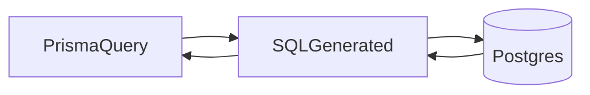

# Lesson 3: SQL Basics (Long-form Enhanced)

> Even if Prisma writes most SQL for you, SQL is still the “physics of data”: it explains what really happens when you filter, join, paginate, and aggregate.

## Table of Contents

- Why SQL still matters (even with Prisma)
- SELECT basics (WHERE, ORDER BY, LIMIT/OFFSET)
- INSERT / UPDATE / DELETE (write safety)
- JOINs (how tables combine)
- Prisma vs SQL (mapping concepts)
- Best practices, pitfalls, troubleshooting
- Advanced patterns (preview): EXPLAIN, pagination, transactions

## Learning Objectives

By the end of this lesson, you will be able to:
- Read and write basic SQL for CRUD operations
- Understand `SELECT`, `WHERE`, and projection (choosing columns)
- Insert, update, and delete rows safely (using `WHERE`!)
- Use joins to combine related tables
- Understand how ORMs like Prisma translate into SQL concepts

## Why SQL Still Matters (Even with Prisma)

Even if you use Prisma, SQL knowledge helps you:
- debug performance issues
- reason about indexes and query plans
- understand what “include relations” actually does



## `SELECT` (Read)

Retrieve data:

```sql
SELECT * FROM users;
SELECT name, email FROM users;
SELECT * FROM users WHERE age > 18;
```

### Common patterns

```sql
-- Sorting
SELECT * FROM users ORDER BY created_at DESC;

-- Limit for pagination
SELECT * FROM users ORDER BY id ASC LIMIT 20 OFFSET 0;
```

## `INSERT` (Create)

Add data:

```sql
INSERT INTO users (name, email) VALUES ('Alice', 'alice@example.com');
```

### Returning inserted rows (Postgres)

```sql
INSERT INTO users (name, email)
VALUES ('Alice', 'alice@example.com')
RETURNING id, name, email;
```

## `UPDATE` (Modify)

Modify data:

```sql
UPDATE users SET name = 'Alice Updated' WHERE id = 1;
```

### Critical safety rule

Always include a `WHERE` clause unless you *intentionally* want to update every row.

## `DELETE` (Remove)

Remove data:

```sql
DELETE FROM users WHERE id = 1;
```

Same safety rule: without a `WHERE`, you delete everything.

## `JOIN` (Combine Related Tables)

Combine tables:

```sql
SELECT users.name, posts.title
FROM users
INNER JOIN posts ON users.id = posts.user_id;
```

### Join types (high-level)

- `INNER JOIN`: only rows with matches on both sides
- `LEFT JOIN`: keep left rows even if no match on right

## Prisma vs SQL

Prisma generates SQL for you:

```typescript
// Prisma
const users = await prisma.user.findMany({
  include: { posts: true },
});

// Equivalent SQL (conceptually)
// SELECT * FROM users;
// SELECT * FROM posts WHERE user_id IN (...);
```

Important: ORMs often run multiple queries for relations rather than a single join, depending on the query.

## Real-World Scenario: Fetch Users With Posts

In SQL, you might join. In Prisma, you might include.
Both can work—the important thing is understanding what happens at scale and how it impacts performance.

## Best Practices

### 1) Avoid `SELECT *` in production code

Select only the columns you need, especially for large tables.

### 2) Use indexes (covered later)

Indexes are essential for fast filtering and joining.

### 3) Treat SQL as a power tool

Even with Prisma, you’ll sometimes need raw SQL for special cases (reporting, migrations).

## Common Pitfalls and Solutions

### Pitfall 1: Forgetting `WHERE` in UPDATE/DELETE

**Problem:** accidental mass updates/deletes.

**Solution:** always double-check queries; use transactions and backups.

### Pitfall 2: Join column mismatch

**Problem:** join uses wrong key, results look duplicated or empty.

**Solution:** join FK → PK (`posts.user_id` → `users.id`) consistently.

### Pitfall 3: Assuming ORM = “no SQL knowledge required”

**Problem:** slow endpoints and hard-to-debug behavior.

**Solution:** learn SQL basics and inspect queries when needed.

## Troubleshooting

### Issue: Query is slow

**Symptoms:**
- seconds-long responses

**Solutions:**
1. Add indexes for filtering/join columns.
2. Use `LIMIT/OFFSET` or cursor-based pagination.
3. Avoid returning huge result sets.

## Advanced Patterns (Preview)

### 1) Query plans (`EXPLAIN`) (concept)

Postgres can show *how* it will execute a query (index scan vs sequential scan).
This is the foundation of debugging performance issues.

### 2) Safer pagination (keyset/cursor)

`OFFSET` pagination gets slower on large tables. Keyset pagination uses a stable ordering key (like `id` or `created_at`) to paginate efficiently.

### 3) Transactions for multi-step changes

When you do “create order + create order items + decrement inventory”, you need a transaction so partial writes don’t corrupt state.

## Next Steps

Now that you know SQL basics:

1. ✅ **Practice**: Write `SELECT` queries with `WHERE`, `ORDER BY`, `LIMIT`
2. ✅ **Experiment**: Join users and posts using `INNER JOIN` and `LEFT JOIN`
3. 📖 **Next Level**: Move into Prisma basics
4. 💻 **Complete Exercises**: Work through [Exercises 01](./exercises-01.md)

## Additional Resources

- [PostgreSQL Tutorial](https://www.postgresql.org/docs/current/tutorial.html)
- [MDN: SQL](https://developer.mozilla.org/en-US/docs/Glossary/SQL)

---

**Key Takeaways:**
- SQL is the language for querying relational databases.
- `SELECT/INSERT/UPDATE/DELETE` cover basic CRUD.
- Always use `WHERE` for safe updates/deletes.
- Joins connect tables via foreign keys; ORMs map to these concepts under the hood.
