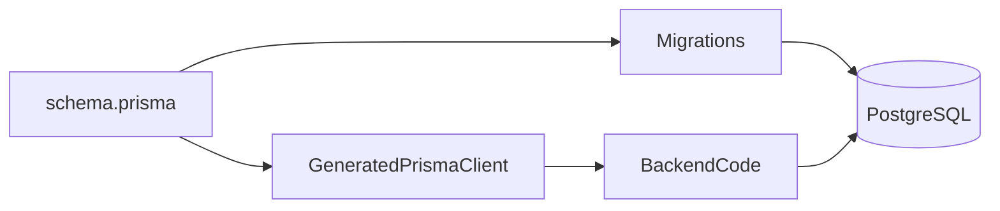

# Lesson 1: Prisma Introduction (Long-form Enhanced)

> Prisma is your “typed bridge” between TypeScript and Postgres. This lesson explains what Prisma is, what it *doesn’t* do for you, and the practical patterns that keep Prisma usage safe and predictable.

## Table of Contents

- What Prisma is and where it fits
- Prisma’s core components (schema, client, migrate, studio)
- A minimal Prisma query (and what happens under the hood)
- Best practices, pitfalls, troubleshooting
- Advanced patterns (preview): singleton client, transactions, raw SQL

## Learning Objectives

By the end of this lesson, you will be able to:
- Explain what Prisma is and where it fits in a TypeScript backend
- Identify Prisma’s main components (schema, client, migrate, studio)
- Understand what “type-safe ORM” means in practice
- Recognize Prisma’s strengths and its trade-offs (you still need SQL fundamentals)
- Write a minimal Prisma Client query and understand what it does

## Why Prisma Matters

Prisma is popular in TypeScript backends because it provides:
- strong typing end-to-end (schema → generated client → code)
- migrations with a clear workflow
- an ergonomic query API that reduces boilerplate

Prisma doesn’t replace database fundamentals—but it makes building safer, faster APIs easier.



## What is Prisma?

Prisma is a modern ORM (Object-Relational Mapping) for TypeScript and Node.js.

In plain terms:
- you describe your data model in a schema
- Prisma generates a typed client for querying
- Prisma provides tooling for migrations and inspection

## Benefits (Practical)

- **Type safety**: queries and results are typed based on your schema
- **Autocomplete**: IDE suggests valid fields and relations
- **Migrations**: schema changes become version-controlled migrations
- **Productivity**: less repetitive SQL boilerplate for common CRUD

## Prisma Components

1. **Prisma Schema** (`schema.prisma`): define models, relations, constraints
2. **Prisma Client**: generated TypeScript client used in code
3. **Prisma Migrate**: migration system to evolve your DB schema
4. **Prisma Studio**: UI to view/edit data during development

## Basic Usage (Prisma Client)

```typescript
import { PrismaClient } from "@prisma/client";

const prisma = new PrismaClient();

const users = await prisma.user.findMany();
```

### What this does

- opens a database connection (via Prisma Client)
- runs a query to retrieve all rows from the `User` table
- returns typed results (`User[]`) based on your schema

## Real-World Scenario: Type Safety Prevents Bugs

If you rename a column or model in your Prisma schema:
- Prisma Client types update after generating
- TypeScript compilation will catch outdated code

That’s a big advantage over hand-written SQL strings scattered across code.

## Best Practices

### 1) Keep schema changes reviewed

Your schema is part of your product. Treat it like code.

### 2) Use a Prisma Client singleton

Avoid creating new Prisma clients per request (connection storms).

### 3) Learn the SQL concepts Prisma maps to

Indexes, joins, constraints, transactions still matter for real apps.

## Common Pitfalls and Solutions

### Pitfall 1: Thinking Prisma “removes the need for SQL knowledge”

**Problem:** You ship slow queries and don’t know why.

**Solution:** Learn SQL basics and inspect query behavior when performance matters.

### Pitfall 2: Creating multiple Prisma clients

**Problem:** “Too many connections” errors in development/production.

**Solution:** Use a singleton pattern for Prisma Client.

### Pitfall 3: Skipping migrations

**Problem:** Local DB and production DB drift.

**Solution:** Use Prisma Migrate consistently for schema changes.

## Troubleshooting

### Issue: Prisma Client can’t connect

**Symptoms:**
- connection errors on startup/queries

**Solutions:**
1. Confirm `DATABASE_URL` points to a running database.
2. Confirm network/credentials are correct.
3. Confirm migrations have been applied.

## Advanced Patterns (Preview)

### 1) Prisma Client singleton (and why it matters)

In development (especially with hot reload), creating many Prisma clients can cause:
- “Too many connections”
- slow startups

The common fix is a singleton client instance (you’ll implement this in the exercises/projects).

### 2) Transactions for multi-step writes

When you need multiple statements to succeed/fail together (e.g., create order + items), use a transaction.
Prisma supports transactions, but you still need to understand the underlying DB guarantees.

### 3) Raw SQL (escape hatch)

Sometimes you need raw SQL:
- reporting queries
- complex joins/aggregations
- certain performance-sensitive operations

Prisma can help, but SQL fundamentals remain important.

## Next Steps

Now that you know what Prisma is:

1. ✅ **Practice**: Open Prisma Studio and inspect a table
2. ✅ **Experiment**: Write a `findMany` and a `create` query
3. 📖 **Next Lesson**: Learn about [Schema Definition](./lesson-02-schema-definition.md)
4. 💻 **Complete Exercises**: Work through [Exercises 02](./exercises-02.md)

## Additional Resources

- [Prisma Docs](https://www.prisma.io/docs)
- [Prisma Studio](https://www.prisma.io/studio)

---

**Key Takeaways:**
- Prisma is a TypeScript-friendly ORM with schema, client, migrations, and studio.
- It improves safety and developer experience but doesn’t replace DB fundamentals.
- Prisma Client is generated from your schema and provides typed queries.
