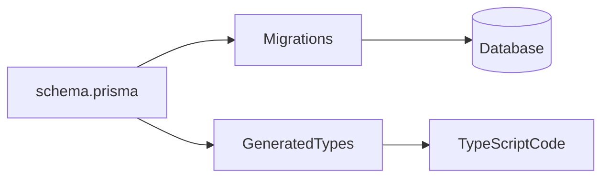

# Lesson 2: Schema Definition (Long-form Enhanced)

> Your Prisma schema is the “contract” between your application and your database. Good schema design makes your code safer, migrations cleaner, and performance problems easier to reason about.

## Table of Contents

- Prisma schema layout (generator + datasource + models)
- Model fields: types, defaults, and nullability
- Modifiers you’ll use constantly (`@id`, `@default`, `@unique`, `@updatedAt`)
- Best practices, pitfalls, troubleshooting
- Advanced patterns (preview): UUIDs, JSON fields, mapping/naming

## Learning Objectives

By the end of this lesson, you will be able to:
- Understand the structure of `schema.prisma` (generator + datasource + models)
- Define models with correct field types and optionality
- Use common field modifiers (`@id`, `@default`, `@unique`, `@updatedAt`)
- Understand how Prisma schema maps to real database tables/columns
- Recognize common pitfalls (wrong optional fields, missing defaults, unsafe uniqueness)

## Why Schema Definition Matters

Your Prisma schema is the source of truth for:
- database structure
- generated client types
- migration history

If your schema is well-designed, your code becomes easier to write and safer to refactor.



## Prisma Schema File Overview

A typical Prisma schema includes:
- `generator`: Prisma Client generation settings
- `datasource`: DB provider settings (connection URL is now configured separately in Prisma 7+)
- `model`: tables/entities

**Important (Prisma 7+ update):**  
Do **not** include `url = env("DATABASE_URL")` in the `datasource` block anymore — it causes validation errors (P1012).  
Instead, connection details are handled in `prisma.config.ts` (already set up in your project).

Correct skeleton:

```prisma
generator client {
  provider = "prisma-client-js"
}

datasource db {
  provider = "postgresql"
  // url is NO LONGER supported here in Prisma 7+
  // Connection is configured via prisma.config.ts
}
```

## Defining Models

Define models in `prisma/schema.prisma`:

```prisma
model User {
  id        Int      @id @default(autoincrement())
  email     String   @unique
  name      String
  age       Int?
  active    Boolean  @default(true)
  createdAt DateTime @default(now())
  updatedAt DateTime @updatedAt
}
```

### What this maps to

In relational terms, this becomes a `users` table with:
- an integer primary key
- a unique `email` column
- timestamps for auditing

## Field Types (Common)

- **String**: text data
- **Int**: integer numbers
- **Float**: decimal numbers
- **Boolean**: true/false
- **DateTime**: dates and times
- **Json**: JSON data

### Practical guidance

- prefer normalized relational structure over JSON columns for most app data
- use `Json` for flexible/rarely queried blobs (carefully)

## Field Modifiers (Common)

- `@id`: primary key
- `@default(...)`: default value
- `@unique`: unique constraint (enforces uniqueness at DB level)
- `@updatedAt`: auto-update timestamp on writes
- `?`: optional/nullable field

### Defaults you’ll commonly use

- `@default(autoincrement())` for integer ids
- `@default(uuid())` for UUID ids (if desired)
- `@default(now())` for created timestamps

## Optional Fields (`?`) and Nullability

In Prisma:
- `age Int?` means the field can be `null`
- without `?`, the field is required

Be intentional: optional fields increase complexity, but are sometimes necessary.

## Real-World Scenario: Designing a User Model

Common choices:
- `email` unique
- `name` required
- `createdAt/updatedAt` for auditing
- `active` boolean for soft-disable

These decisions impact how you build auth and admin flows later.

## Best Practices

### 1) Use constraints to protect data

Unique constraints and required fields prevent invalid states.

### 2) Add timestamps early

They’re useful for debugging and product analytics.

### 3) Think about IDs intentionally

Autoincrement ints are simple; UUIDs can be useful for public IDs and distributed systems.

## Common Pitfalls and Solutions

### Pitfall 1: Missing `@unique` on fields you assume are unique

**Problem:** duplicate emails/users appear.

**Solution:** enforce uniqueness at DB level with `@unique`.

### Pitfall 2: Making too many fields optional

**Problem:** every query must handle nulls.

**Solution:** make fields required when possible; model optionality intentionally.

### Pitfall 3: Using JSON for everything

**Problem:** queries become slow and constraints are weak.

**Solution:** prefer relational modeling; use JSON selectively.

## Troubleshooting

### Issue: Prisma Client types don’t match schema changes

**Symptoms:**
- TypeScript errors or missing fields in autocomplete

**Solutions:**
1. Run `npx prisma generate`.
2. Apply migrations if schema changed (`npx prisma migrate dev --name ...`).

### Issue: Validation error about `url` in datasource (P1012)

**Cause:** Old tutorials include `url = env("DATABASE_URL")` in `schema.prisma`.
**Solution:** Remove it entirely — your `prisma.config.ts` handles the connection.

## Advanced Patterns (Preview)

### 1) UUID ids vs autoincrement ids (trade-off)

- autoincrement ints are simple and fast
- UUIDs are useful for distributed systems and avoiding “guessable ids”

Pick intentionally, and stay consistent.

### 2) Mapping and naming (`@map`, `@@map`)

You can map Prisma model/field names to existing DB naming conventions (snake_case tables/columns), which is helpful when integrating with an existing schema.

### 3) JSON fields (careful)

`Json` can be great for flexible blobs, but it’s easy to overuse.
If you need to filter/join often, prefer normalized relational fields.

## Next Steps

Now that you can define schemas:

1. ✅ **Practice**: Add a `User` model with email uniqueness and timestamps (use the updated datasource block above)
2. ✅ **Experiment**: Add an optional field and handle it in queries
3. 📖 **Next Lesson**: Learn about [Basic Models](./lesson-03-basic-models.md)
4. 💻 **Complete Exercises**: Work through [Exercises 02](./exercises-02.md)

## Additional Resources

- [Prisma Schema Reference](https://www.prisma.io/docs/reference/api-reference/prisma-schema-reference)
- [PostgreSQL: Constraints](https://www.postgresql.org/docs/current/ddl-constraints.html)
- [Prisma 7 Upgrade Guide (Datasource Changes)](https://www.prisma.io/docs/orm/more/upgrade-guides/upgrading-versions/upgrading-to-prisma-7)

---

**Key Takeaways:**
- `schema.prisma` defines your DB structure and generates your typed client.
- Use types + modifiers to enforce correctness (required, unique, defaults).
- Model optional fields intentionally to reduce null-handling complexity.
- In Prisma 7+, move connection URLs out of `schema.prisma` into `prisma.config.ts`.