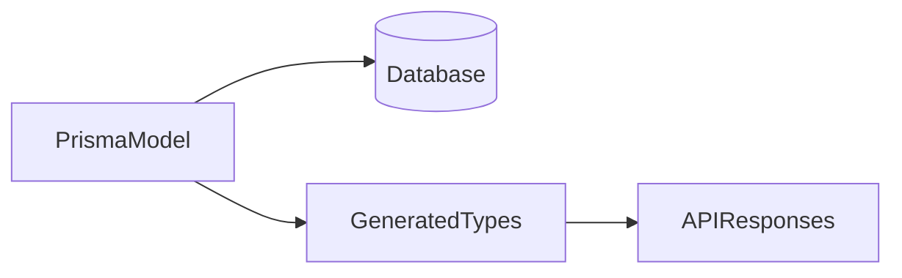

# Lesson 3: Basic Models (Long-form Enhanced)

> “Basic models” are where most projects either become clean and maintainable—or slowly drift into a hard-to-change schema. This lesson focuses on practical modeling choices and the tradeoffs behind them.

## Table of Contents

- What “good models” look like in practice
- Constraints, defaults, optional fields (integrity vs flexibility)
- Enums (safe fixed sets)
- Real-world scenario: auth-oriented modeling
- Best practices, pitfalls, troubleshooting
- Advanced patterns (preview): soft delete, public ids, audit fields

## Learning Objectives

By the end of this lesson, you will be able to:
- Create practical Prisma models for real application entities
- Use defaults, optional fields, and constraints to enforce data integrity
- Define enums and use them safely in models
- Understand how model decisions affect API design and future migrations
- Recognize common pitfalls (missing timestamps, storing wrong types, overusing optional fields)

## Why Model Design Matters

A model is more than “fields”:
- it defines what data can exist
- it enforces constraints at the database layer
- it shapes the TypeScript types you use throughout your app

Good models reduce bugs and simplify your API and UI.



## Creating Models (Example: Post)

```prisma
model Post {
  id        Int      @id @default(autoincrement())
  title     String
  content   String?
  published Boolean  @default(false)
  createdAt DateTime @default(now())
}
```

### Practical notes

- `content String?` means the post can be created without content
- `published` defaults to `false` (draft by default)
- `createdAt` gives you a timeline for sorting and auditing

Consider also adding `updatedAt DateTime @updatedAt` in many real apps.

## Field Constraints (Integrity)

Constraints protect your data from invalid states.

```prisma
model User {
  id    Int    @id @default(autoincrement())
  email String @unique
  name  String
  age   Int    @default(0)
}
```

### Why `@unique` is important

If emails must be unique, enforce that in the database, not just in code.

### Defaults: use wisely

`age @default(0)` might be okay for demos, but in real apps you might prefer:
- optional `age Int?`
- or store birth date (more accurate over time)

## Enums (Fixed Sets of Values)

Enums let you restrict a field to a known set of values:

```prisma
enum Role {
  USER
  ADMIN
  MODERATOR
}

model User {
  id   Int  @id @default(autoincrement())
  role Role @default(USER)
}
```

### Why enums help

- prevents invalid strings like `"admn"`
- improves query safety and autocomplete

### Trade-off

Changing enums later can require careful migrations, especially in production.

## Real-World Scenario: Modeling an Auth System

Common user fields:
- `email` unique
- `passwordHash` (not `password`)
- `role` enum
- timestamps for auditing

Model design decisions directly affect:
- what validation you need
- how you implement authorization checks

## Best Practices

### 1) Add audit timestamps early

`createdAt` and `updatedAt` are almost always useful.

### 2) Use constraints to enforce business rules

Unique, required, and relation constraints prevent many bugs.

### 3) Keep models focused

Don’t overload a single model with unrelated concerns; split when needed.

## Common Pitfalls and Solutions

### Pitfall 1: Storing passwords incorrectly

**Problem:** storing plaintext passwords or naming hashes as `password`.

**Solution:** store only `passwordHash` and never return it from APIs.

### Pitfall 2: Making everything optional

**Problem:** your app becomes “null checks everywhere”.

**Solution:** make fields required unless they are truly optional.

### Pitfall 3: Missing `updatedAt`

**Problem:** you can’t tell when records were modified.

**Solution:** add `updatedAt DateTime @updatedAt`.

## Troubleshooting

### Issue: Prisma migration fails after model changes

**Symptoms:**
- migration errors, schema drift

**Solutions:**
1. Review changes for breaking constraints (adding required fields without defaults).
2. Prefer phased migrations for production (covered in migrations section).

## Advanced Patterns (Preview)

### 1) Soft delete (`deletedAt`)

Instead of deleting rows, add `deletedAt DateTime?` and filter it out by default.
This is common when you need auditability or “undo” behavior.

### 2) Public ids vs internal ids

Many apps keep internal autoincrement ids, but expose UUIDs (or other public ids) externally to avoid predictable identifiers.

### 3) Audit fields beyond timestamps

For important entities, you may add:
- `createdByUserId`
- `updatedByUserId`
- change logs (separate table)

## Next Steps

Now that you can build basic models:

1. ✅ **Practice**: Model `User` + `Post` for a blog app
2. ✅ **Experiment**: Add an enum (`Role`) and use it in authorization logic
3. 📖 **Next Level**: Move into relationships and how models connect
4. 💻 **Complete Exercises**: Work through [Exercises 02](./exercises-02.md)

## Additional Resources

- [Prisma Schema Reference](https://www.prisma.io/docs/reference/api-reference/prisma-schema-reference)
- [PostgreSQL: Data Types](https://www.postgresql.org/docs/current/datatype.html)

---

**Key Takeaways:**
- Models define data integrity through types, defaults, and constraints.
- Use `@unique` and required fields to prevent invalid states.
- Enums encode fixed sets of values and improve safety/autocomplete.
- Add timestamps and plan for migrations when changing model meaning.
