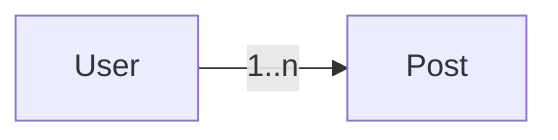

# Lesson 2: One-to-Many Relationships (Long-form Enhanced)

> One-to-many relationships are the backbone of most real schemas. This lesson focuses on modeling them correctly, querying them safely (avoiding overfetching), and understanding where performance problems come from.

## Table of Contents

- Modeling one-to-many (relation fields vs foreign keys)
- Querying relations (`include` vs `select`)
- Creating related records (`userId` vs nested `connect`)
- Best practices, pitfalls, troubleshooting
- Advanced patterns (preview): N+1, pagination, cascade vs restrict

## Learning Objectives

By the end of this lesson, you will be able to:
- Model one-to-many relationships in Prisma using a foreign key
- Understand the difference between relation fields and foreign key fields
- Query one-to-many relations using `include` and nested `select`
- Create related records using `userId` or nested `connect`
- Avoid common pitfalls (overfetching, N+1 queries, missing FK integrity)

## Why One-to-Many Matters

One-to-many relationships are the most common in app databases:
- user → posts
- post → comments
- customer → orders

They allow you to model ownership and collections naturally.



## Modeling One-to-Many in Prisma

One user has many posts:

```prisma
model User {
  id    Int    @id @default(autoincrement())
  email String @unique
  posts Post[]
}

model Post {
  id     Int    @id @default(autoincrement())
  title  String
  userId Int
  user   User   @relation(fields: [userId], references: [id])
}
```

### What each part means

- `Post.userId`: the FK column stored in the database
- `Post.user`: relation field used by Prisma to navigate to the User
- `User.posts`: back relation array of posts belonging to the user

## Querying One-to-Many

### Get user with all posts

```typescript
const user = await prisma.user.findUnique({
  where: { id: 1 },
  include: { posts: true },
});
```

### Get post with user

```typescript
const post = await prisma.post.findUnique({
  where: { id: 1 },
  include: { user: true },
});
```

### Prefer selecting only what you need

```typescript
const user = await prisma.user.findUnique({
  where: { id: 1 },
  select: {
    id: true,
    email: true,
    posts: { select: { id: true, title: true } },
  },
});
```

## Creating Related Records

### Using `userId` (simple)

```typescript
const post = await prisma.post.create({
  data: {
    title: "Hello world",
    userId: 1,
  },
});
```

### Using nested `connect` (explicit relationship)

```typescript
const post = await prisma.post.create({
  data: {
    title: "Hello world",
    user: { connect: { id: 1 } },
  },
});
```

## Real-World Scenario: Building a Posts API

Common endpoints:
- `GET /users/:id/posts` (list posts for a user)
- `POST /users/:id/posts` (create a post owned by a user)

Backend must validate:
- the user exists
- the requester is allowed (authorization)

## Best Practices

### 1) Validate foreign keys

Check the parent exists before creating children, or catch FK constraint errors cleanly.

### 2) Use `select` for API safety

Avoid returning the full user object from posts endpoints if it includes sensitive fields.

### 3) Avoid N+1 queries

Don’t loop and run a query per record. Use `include`/relation queries intentionally.

## Common Pitfalls and Solutions

### Pitfall 1: Overfetching

**Problem:** `include: { user: true }` returns too much user data.

**Solution:** use nested `select` to return safe fields only.

### Pitfall 2: Missing referential integrity

**Problem:** posts reference users that don’t exist.

**Solution:** use foreign key constraints and apply migrations consistently.

### Pitfall 3: Assuming relations are “automatic” without FK data

**Problem:** you create posts without setting `userId` or `connect`.

**Solution:** set FK fields or use nested writes.

## Troubleshooting

### Issue: `include: { posts: true }` returns empty array

**Symptoms:**
- user exists but `posts` is `[]`

**Solutions:**
1. Confirm posts exist for that `userId`.
2. Confirm you’re connected to the expected database.

### Issue: Creating a post fails with FK constraint error

**Symptoms:**
- create throws an error referencing foreign keys

**Solutions:**
1. Confirm the parent user exists.
2. Validate input and return 404/400 as appropriate.

## Advanced Patterns (Preview)

### 1) The N+1 problem (concept)

If you load a list of users and then load posts for each user in a loop, you can accidentally run \(1 + N\) queries.
The fix is usually to reshape the query (include/select) or query from the “many” side with filters and pagination.

### 2) Pagination on the “many” side

For large collections (posts/comments/orders), always design endpoints with pagination in mind.
Loading “all posts” is fine for demos, but not for production datasets.

### 3) Delete behavior: cascade vs restrict vs soft delete

When a parent has children, you must decide what happens on delete:
- restrict deletion (safest default)
- cascade (convenient, riskier)
- soft delete (common in products that need audit/restore)

## Next Steps

Now that you understand one-to-many:

1. ✅ **Practice**: Add `User` + `Post` and create posts for a user
2. ✅ **Experiment**: Return only safe user fields from a posts endpoint
3. 📖 **Next Lesson**: Learn about [Many-to-Many](./lesson-03-many-to-many.md)
4. 💻 **Complete Exercises**: Work through [Exercises 03](./exercises-03.md)

## Additional Resources

- [Prisma Docs: Relation queries](https://www.prisma.io/docs/concepts/components/prisma-client/relation-queries)
- [PostgreSQL: Foreign keys](https://www.postgresql.org/docs/current/ddl-constraints.html)

---

**Key Takeaways:**
- One-to-many uses a foreign key on the “many” side.
- Relation fields (`user`, `posts`) are Prisma navigation helpers; FK fields (`userId`) are stored data.
- Use `select` to avoid overfetching and leaking fields.
- Validate parents and avoid N+1 query patterns.
