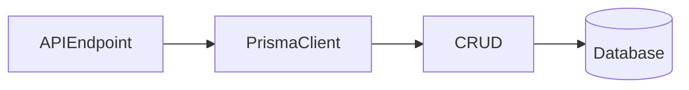

# Lesson 1: CRUD Operations (Long-form Enhanced)

> CRUD is where schemas become “real”: create/read/update/delete patterns define your API behavior, your error handling, and your data safety. This lesson focuses on doing CRUD *predictably* (status codes, not-found behavior, and safe field selection).

## Table of Contents

- Create / read / update / delete with Prisma
- Not-found behaviors (null vs throw)
- `select` for safe/minimal data
- Bulk operations (`updateMany`/`deleteMany`) and safety
- Best practices, pitfalls, troubleshooting
- Advanced patterns (preview): soft delete, upsert, transactions

## Learning Objectives

By the end of this lesson, you will be able to:
- Perform CRUD with Prisma (`create`, `findMany`, `findUnique`, `update`, `delete`)
- Understand the “not found” behaviors of different Prisma operations
- Use `select` to return safe/minimal data
- Recognize when to use `updateMany`/`deleteMany` (and why they’re dangerous)
- Avoid common pitfalls (overfetching, leaking sensitive fields, assuming update returns null)

## Why CRUD Matters

CRUD operations are the core building blocks of most backend features:
- create users/posts/orders
- read lists and details
- update profiles/settings
- delete (or soft-delete) records



## Create

```typescript
const user = await prisma.user.create({
  data: {
    email: "alice@example.com",
    name: "Alice",
  },
});
```

### Common add-on: select safe fields

```typescript
const user = await prisma.user.create({
  data: { email: "alice@example.com", name: "Alice" },
  select: { id: true, email: true, name: true },
});
```

## Read

### Find many

```typescript
const users = await prisma.user.findMany();
```

### Find unique

```typescript
const user = await prisma.user.findUnique({
  where: { id: 1 },
});
```

### Important behavior

`findUnique` returns `null` if not found. It does **not** throw.

## Update

```typescript
const user = await prisma.user.update({
  where: { id: 1 },
  data: { name: "Alice Updated" },
});
```

### Important behavior

`update` typically throws if the record doesn’t exist. Many APIs:
- check existence first (return 404)
- or catch and translate the Prisma error to 404

## Delete

```typescript
await prisma.user.delete({
  where: { id: 1 },
});
```

Delete typically throws if the record doesn’t exist.

## Bulk Operations (Use Carefully)

### `updateMany`

```typescript
await prisma.user.updateMany({
  where: { active: false },
  data: { active: true },
});
```

### `deleteMany`

```typescript
await prisma.user.deleteMany({
  where: { email: { endsWith: "@example.com" } },
});
```

Bulk operations are powerful—double-check your filters and consider transactions.

## Real-World Scenario: CRUD Endpoints

Typical API patterns:
- 201 on create
- 200 on reads/updates
- 404 when resource doesn’t exist
- 409 on unique conflicts

CRUD becomes reliable when you combine:
- input validation
- correct status codes
- safe selection of fields

## Best Practices

### 1) Use `select` for API safety

Return only fields needed by the client and never return secrets.

### 2) Handle not-found consistently

Decide how to translate “missing” into 404 across endpoints.

### 3) Be cautious with bulk writes

Avoid accidental mass updates/deletes by requiring strong filters.

## Common Pitfalls and Solutions

### Pitfall 1: Overfetching

**Problem:** you return entire objects including fields the client doesn’t need.

**Solution:** use `select`.

### Pitfall 2: Assuming `update` returns null

**Problem:** you expect `update` to return null for missing records.

**Solution:** know which operations throw vs return null; translate errors consistently.

### Pitfall 3: Accidentally bulk updating/deleting

**Problem:** missing `where` leads to broad changes.

**Solution:** enforce strong filters and add safety checks in code review.

## Troubleshooting

### Issue: Unique constraint errors on create/update

**Symptoms:**
- creating a user with duplicate email fails

**Solutions:**
1. Check existence first and return 409.
2. Catch and translate the Prisma error to 409.

### Issue: Update/delete throws unexpectedly

**Symptoms:**
- 500 errors on missing records

**Solutions:**
1. Check existence with `findUnique` first.
2. Or catch and map to a 404 error response.

## Advanced Patterns (Preview)

### 1) Soft delete instead of delete

Instead of `delete`, add `deletedAt DateTime?` and set it on “delete”.
Then filter `deletedAt: null` in reads so you can restore/audit later.

### 2) `upsert` for idempotent operations

`upsert` can simplify “create or update” flows, but you still need to design around unique constraints and race conditions.

### 3) Transactions for multi-step updates

If an operation spans multiple writes (create order + items), wrap it in a transaction so partial failures don’t corrupt state.

## Next Steps

Now that you can do basic CRUD:

1. ✅ **Practice**: Add `select` to all queries in your API
2. ✅ **Experiment**: Implement soft-delete (set `deletedAt` instead of delete)
3. 📖 **Next Lesson**: Learn about [Filtering and Sorting](./lesson-02-filtering-sorting.md)
4. 💻 **Complete Exercises**: Work through [Exercises 04](./exercises-04.md)

## Additional Resources

- [Prisma Client CRUD](https://www.prisma.io/docs/concepts/components/prisma-client/crud)

---

**Key Takeaways:**
- CRUD is the foundation of most app features.
- Some operations return `null` when missing; others throw—handle consistently.
- Use `select` to avoid overfetching and leaking sensitive data.
- Bulk operations are powerful—use them carefully with strong filters.
