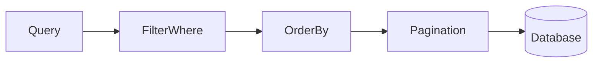

# Lesson 2: Filtering and Sorting (Long-form Enhanced)

> Filtering, sorting, and pagination are where “it works locally” turns into “it scales in production.” This lesson focuses on building stable, predictable queries and avoiding performance traps.

## Table of Contents

- Filtering with `where` (common operators)
- Combining filters safely (`AND`/`OR`)
- Sorting with stable ordering (`orderBy` + tie-breakers)
- Pagination (`take`/`skip`) and limitations
- Best practices, pitfalls, troubleshooting
- Advanced patterns (preview): cursor pagination, indexes, search strategy

## Learning Objectives

By the end of this lesson, you will be able to:
- Filter Prisma queries using `where` with common operators
- Combine filters with `AND`/`OR` safely
- Sort results with `orderBy` (single and multi-field)
- Paginate results with `take`/`skip` (and understand limitations)
- Avoid common pitfalls (unindexed filters, unstable ordering, unbounded queries)

## Why Filtering and Sorting Matter

Most app screens need:
- search (filter by name/email)
- segmentation (active users only)
- sorting (newest first)
- pagination (don’t load 100k rows)

These are critical for performance and UX.



## Filtering (`where`)

```typescript
const users = await prisma.user.findMany({
  where: {
    email: { contains: "@example.com" },
    age: { gte: 18 },
  },
});
```

### Common string filters

```typescript
where: {
  email: { contains: "@", mode: "insensitive" },
  name: { startsWith: "Al" },
}
```

### Common numeric/date filters

```typescript
where: {
  age: { gt: 0, lt: 120 },
  createdAt: { gte: new Date("2025-01-01") },
}
```

### Combining conditions (AND/OR)

```typescript
const users = await prisma.user.findMany({
  where: {
    OR: [{ role: "ADMIN" }, { role: "MODERATOR" }],
    AND: [{ active: true }],
  },
});
```

## Sorting (`orderBy`)

```typescript
const users = await prisma.user.findMany({
  orderBy: { createdAt: "desc" },
});
```

### Multi-field sorting (stable ordering)

```typescript
const users = await prisma.user.findMany({
  orderBy: [{ createdAt: "desc" }, { id: "asc" }],
});
```

Adding a unique tie-breaker (like `id`) helps keep pagination stable.

## Pagination (`take` / `skip`)

```typescript
const users = await prisma.user.findMany({
  orderBy: { id: "asc" },
  take: 10,
  skip: 0,
});
```

### Skip/Take trade-off

`skip` can become slow on large tables (DB must scan/skip many rows).
For big datasets, cursor pagination is often better (advanced topic).

## Putting It Together

```typescript
const users = await prisma.user.findMany({
  where: { active: true },
  orderBy: [{ name: "asc" }, { id: "asc" }],
  take: 10,
  skip: 0,
});
```

## Real-World Scenario: Search + Sort + Pagination

Common endpoint behavior:
- `GET /users?q=alice&page=1&limit=20&sort=createdAt`
- backend builds `where` and `orderBy` from validated query params

This is why request validation and consistent response formatting matter.

## Best Practices

### 1) Always paginate list endpoints

Unbounded queries are a common production incident cause.

### 2) Sort with a stable tie-breaker

Add a unique field (like `id`) to keep ordering stable.

### 3) Index what you filter by

Frequent filters should be backed by indexes (covered later).

## Common Pitfalls and Solutions

### Pitfall 1: Unbounded list queries

**Problem:** `findMany()` returns too many rows.

**Solution:** always use `take` (and validate `limit`).

### Pitfall 2: Unstable pagination

**Problem:** results “jump” between pages when multiple rows share the same sort key.

**Solution:** add a unique tie-breaker to `orderBy`.

### Pitfall 3: Slow filters

**Problem:** filtering by unindexed columns causes slow scans.

**Solution:** add indexes for common filters and consider query shape.

## Troubleshooting

### Issue: Filtering returns unexpected results

**Symptoms:**
- search doesn’t match case, or matches too much

**Solutions:**
1. Use `mode: "insensitive"` for case-insensitive search (where supported).
2. Use more specific operators (`startsWith`, `equals`) if needed.

### Issue: Pagination is slow

**Symptoms:**
- high page numbers are slow

**Solutions:**
1. Avoid large `skip` values; consider cursor pagination.
2. Add indexes and stable ordering.

## Advanced Patterns (Preview)

### 1) Cursor pagination (keyset)

At scale, cursor pagination (e.g., “give me the next page after id X”) is often faster and more stable than large `skip` values.

### 2) Indexes aligned to your filters

If you filter by `email` or `createdAt` frequently, indexes make a dramatic difference.
Indexes are a trade-off: faster reads, slower writes.

### 3) Search strategy (contains vs startsWith vs full-text)

`contains` can be expensive on large datasets. For serious search:
- prefer structured filters (`equals`, `startsWith`) when possible
- consider Postgres full-text search (advanced, not required yet)

## Next Steps

Now that you can filter and sort:

1. ✅ **Practice**: Implement a search query using `contains` + `mode: "insensitive"`
2. ✅ **Experiment**: Add stable ordering (`orderBy` with id tie-breaker)
3. 📖 **Next Lesson**: Learn about [Aggregations](./lesson-03-aggregations.md)
4. 💻 **Complete Exercises**: Work through [Exercises 04](./exercises-04.md)

## Additional Resources

- [Prisma Docs: Filtering and sorting](https://www.prisma.io/docs/concepts/components/prisma-client/filtering-and-sorting)

---

**Key Takeaways:**
- Use `where` filters for search/segmentation; combine with `AND`/`OR` carefully.
- Use `orderBy` (with tie-breakers) for stable, predictable ordering.
- Paginate list endpoints with `take/skip`, and consider cursor pagination at scale.
