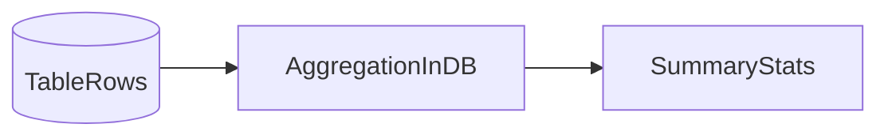

# Lesson 3: Aggregations (Long-form Enhanced)

> Aggregations are how you build dashboards and analytics without pulling entire tables into your app. This lesson focuses on computing summaries safely and keeping reporting queries performant.

## Table of Contents

- `count` vs `findMany().length`
- `aggregate` (min/max/avg/sum)
- `groupBy` for reporting
- Performance considerations (filters, indexes, result size)
- Best practices, pitfalls, troubleshooting
- Advanced patterns (preview): materialized views, rollups, time-windowing

## Learning Objectives

By the end of this lesson, you will be able to:
- Use Prisma `count` for totals (with filters)
- Use `aggregate` for stats (min/max/avg/sum)
- Use `groupBy` to build reports (counts by role/status/etc.)
- Understand performance considerations (indexes, grouping on large tables)
- Avoid common pitfalls (grouping without filters, confusing `_count` semantics)

## Why Aggregations Matter

Aggregations power:
- dashboards (“active users count”)
- analytics (“average order value”)
- admin panels (“users by role”)

They let you compute summaries without fetching all rows into your app.



## `count`

Count rows matching a filter:

```typescript
const count = await prisma.user.count({
  where: { active: true },
});
```

### Why this is better than `findMany().length`

`count` runs in the database and returns only a number, which is faster and cheaper.

## `aggregate`

Compute summary stats:

```typescript
const stats = await prisma.user.aggregate({
  _count: { id: true },
  _avg: { age: true },
  _max: { age: true },
  _min: { age: true },
  _sum: { age: true },
});
```

### With filters

```typescript
const stats = await prisma.user.aggregate({
  where: { active: true },
  _avg: { age: true },
});
```

## `groupBy`

Group results by one or more fields:

```typescript
const grouped = await prisma.user.groupBy({
  by: ["role"],
  _count: { id: true },
});
```

### Group + filter

```typescript
const grouped = await prisma.user.groupBy({
  by: ["role"],
  where: { active: true },
  _count: { id: true },
});
```

### Group + order + limit (reporting)

```typescript
const grouped = await prisma.user.groupBy({
  by: ["role"],
  _count: { id: true },
  orderBy: { _count: { id: "desc" } },
  take: 10,
});
```

## Real-World Scenario: Admin Dashboard Widgets

Typical widgets:
- total users
- active users
- users by role
- newest signups this week

These should use DB aggregations, not fetch-all-and-calculate-in-JS.

## Performance Notes

Aggregations can be expensive on large tables:
- grouping requires scanning rows
- filters without indexes can be slow

Best practices:
- index columns you filter/group on frequently
- scope aggregations to relevant time windows (`createdAt >= ...`) when possible

## Best Practices

### 1) Filter before you group

Always ask: “Do I really need all historical rows?”

### 2) Use aggregates instead of loading full tables

Don’t fetch 1M rows to count them.

### 3) Keep reporting endpoints controlled

Heavy analytics endpoints can become a performance hotspot.

## Common Pitfalls and Solutions

### Pitfall 1: Grouping on high-cardinality fields

**Problem:** grouping on unique-ish fields creates huge group results.

**Solution:** group on meaningful categories (role, status), not IDs.

### Pitfall 2: Unfiltered groupBy on large tables

**Problem:** slow queries and high DB load.

**Solution:** filter by date ranges or active flags; add indexes.

### Pitfall 3: Misreading `_count`

**Problem:** misunderstanding whether `_count` counts rows or specific fields.

**Solution:** use `_count: { _all: true }` when you want total rows (model dependent) or `_count: { id: true }` consistently.

## Troubleshooting

### Issue: Aggregation returns `null` values

**Symptoms:**
- `_avg.age` is null

**Solutions:**
1. Confirm there are rows matching the filter.
2. Confirm the field isn’t null for all matching rows.

### Issue: GroupBy is slow

**Symptoms:**
- timeouts or high latency

**Solutions:**
1. Add filters (time window, active flag).
2. Add indexes on group/filter fields.
3. Reduce result size with `take` and sort by count.

## Advanced Patterns (Preview)

### 1) Time windowing (make analytics queries feasible)

Most real analytics is bounded (“last 7 days”, “this month”).
Time windows reduce scanned rows and keep queries predictable.

### 2) Rollups/materialized views (concept)

For heavy dashboards, you may precompute summaries (nightly/hourly) instead of running expensive groupBy queries on every request.

### 3) Beware “high cardinality” groupings

Grouping by fields with many unique values (like email) is usually not useful and can be expensive.

## Next Steps

Now that you can compute aggregates:

1. ✅ **Practice**: Build “users by role” and “active users count” queries
2. ✅ **Experiment**: Add date filters to make analytics queries faster
3. 📖 **Next Level**: Move into migrations
4. 💻 **Complete Exercises**: Work through [Exercises 04](./exercises-04.md)

## Additional Resources

- [Prisma Docs: Aggregation, grouping, and summarizing](https://www.prisma.io/docs/concepts/components/prisma-client/aggregation-grouping-summarizing)

---

**Key Takeaways:**
- Use `count` and `aggregate` for summary stats without loading full tables.
- Use `groupBy` for reporting (counts by categories).
- Filter and index appropriately to keep aggregation queries fast.
