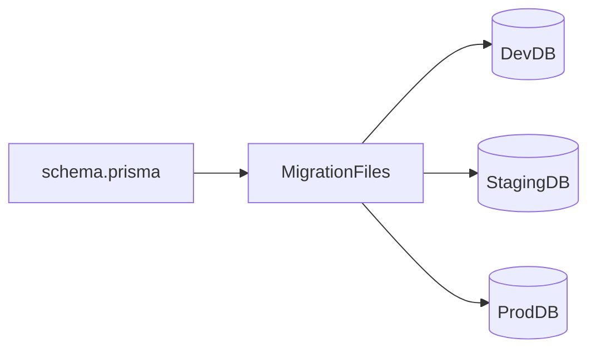

# Lesson 1: Migration Concepts (Long-form Enhanced)

> Migrations are how teams change databases safely over time. This lesson explains what migrations are, why they matter in production, and the workflows that keep dev/staging/prod consistent.

## Table of Contents

- What migrations are (and why teams rely on them)
- Prisma migration workflow (dev vs production)
- Risks: data loss, locks, downtime
- Best practices, pitfalls, troubleshooting
- Advanced patterns (preview): phased migrations, deploy ordering, recovery plans

## Learning Objectives

By the end of this lesson, you will be able to:
- Explain what database migrations are and why teams rely on them
- Understand how Prisma Migrate fits into schema evolution
- Describe the difference between development and production migration workflows
- Recognize risks of schema changes (data loss, locking, downtime)
- Apply best practices for safe, reviewable migrations

## Why Migrations Matter

Databases change over time:
- new fields
- new tables
- new relationships
- constraints and indexes

Migrations are how you apply these changes consistently across environments (dev, staging, prod).

## What are Migrations?

Migrations are version-controlled, ordered changes to your database schema.

They provide:
- a history of schema evolution
- a repeatable way to set up new environments
- a safer deployment process (changes are explicit and reviewable)

## Why Migrations?

- **Version control**: track schema changes over time
- **Reproducibility**: apply the same schema to all environments
- **Collaboration**: teams can coordinate schema changes safely
- **Auditing**: you can see when/why a schema changed

### About “rollback”

Some systems support explicit down-migrations; Prisma’s workflow often emphasizes forward-only migrations.
In real production systems, rollback strategies usually involve:
- backups
- feature flags
- phased migrations

## Prisma Migration Workflow (High-Level)

1. Modify `schema.prisma`
2. Create migration (dev): `npx prisma migrate dev --name ...`
3. Prisma generates SQL migration files
4. Migration is applied to the database
5. Prisma Client is regenerated to match the schema

## Migration Files

Migrations are stored in `prisma/migrations/`:
- each migration has a timestamp and name
- each contains SQL to apply the changes
- migrations can be reviewed in PRs before deployment

## Risks and Real-World Concerns

Schema changes can cause:
- data loss (dropping columns/tables)
- locks and downtime (large table rewrites)
- app incompatibility if deployed out of order

This is why migrations must be treated as production changes, not “just dev tooling”.

## Best Practices

### 1) Keep migrations small and focused

One conceptual change per migration is easier to review and safer to deploy.

### 2) Review generated SQL

Even if Prisma generates it, you should understand what will happen.

### 3) Plan for backwards compatibility

Use phased changes:
- add nullable column
- backfill data
- update app
- enforce non-null constraint later

## Common Pitfalls and Solutions

### Pitfall 1: Making breaking schema changes without a plan

**Problem:** adding a required column to a large table breaks writes or fails migration.

**Solution:** do phased migrations with defaults/backfills.

### Pitfall 2: Treating production like development

**Problem:** using dev-only commands that reset or rewrite DB.

**Solution:** use `migrate deploy` in production and never reset prod DB.

### Pitfall 3: Not applying migrations in CI/staging

**Problem:** production deployment fails unexpectedly.

**Solution:** always test migrations in a staging-like environment.

## Troubleshooting

### Issue: Migrations out of sync

**Symptoms:**
- schema doesn’t match DB
- Prisma warns about migration state

**Solutions:**
1. Verify environment variables (`DATABASE_URL`) point to the correct DB.
2. Use `prisma migrate status` to inspect migration state.
3. Apply missing migrations via the correct workflow.

## Advanced Patterns (Preview)

### 1) Phased migrations (expand/contract)

For zero-downtime-ish changes:
- **expand** schema (add nullable columns, new tables)
- deploy code that can handle both old/new
- **contract** schema later (make NOT NULL, drop old columns)

### 2) Deploy ordering and backwards compatibility

In distributed systems, you often have multiple app instances running different versions during rollout. Schema changes must tolerate that window.

### 3) Recovery plans beat “perfect rollbacks”

In production, “roll back a migration” is often unrealistic. Prefer:
- backups/restore procedures
- forward-fix migrations
- feature flags to reduce blast radius

## Next Steps

Now that you understand the purpose and risks of migrations:

1. ✅ **Practice**: Make a small schema change and generate a migration
2. ✅ **Experiment**: Review the SQL and explain what it does
3. 📖 **Next Lesson**: Learn about [Creating Migrations](./lesson-02-creating-migrations.md)
4. 💻 **Complete Exercises**: Work through [Exercises 05](./exercises-05.md)

## Additional Resources

- [Prisma Docs: Migrate](https://www.prisma.io/docs/concepts/components/prisma-migrate)
- [PostgreSQL: ALTER TABLE](https://www.postgresql.org/docs/current/sql-altertable.html)

---

**Key Takeaways:**
- Migrations are version-controlled schema changes.
- They keep dev/staging/prod consistent and make deployments safer.
- Schema changes can cause downtime/data loss; plan and review SQL.
- Prefer phased, backwards-compatible migrations for production.
