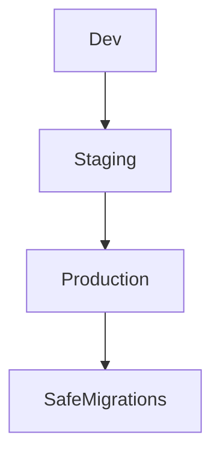

# Lesson 3: Migration Strategies (Long-form Enhanced)

> Migration strategy is what keeps production systems safe: it’s the difference between “schema changed” and “system survived the deploy.” This lesson focuses on phased changes, risk reduction, and practical recovery planning.

## Table of Contents

- Dev vs staging vs production workflows
- Phased migrations (backwards-compatible changes)
- Large table risks (locks, rewrites) and mitigations
- Rollbacks in the real world
- Best practices, pitfalls, troubleshooting
- Advanced patterns (preview): index concurrency, background backfills, zero-downtime thinking

## Learning Objectives

By the end of this lesson, you will be able to:
- Follow a safe migration workflow in dev, staging, and production
- Use phased migrations to avoid downtime and breaking changes
- Understand when migrations can lock tables and how to reduce risk
- Plan rollback and recovery strategies (backups, forward fixes)
- Recognize common pitfalls (resetting the wrong DB, large table rewrites, incompatible deploy order)

## Why Strategy Matters

Migrations are easy when your database is empty.
They become serious when you have:
- production data
- multiple services
- high traffic

Strategy is how you avoid:
- downtime
- data loss
- broken deployments



## Development Workflow (Fast Iteration)

1. Modify schema
2. Create migration immediately
3. Apply it to local DB
4. Run tests and verify behavior
5. Commit schema + migrations together

This keeps your local environment aligned with the repo.

## Production Workflow (Safety First)

1. Test migrations in staging
2. Review migration SQL for risk (drops, type changes, NOT NULL)
3. Backup database (or ensure restore strategy)
4. Apply migrations with: `npx prisma migrate deploy`
5. Deploy app code that is compatible with the new schema

## Phased Migration Strategy (Backwards-Compatible Changes)

For many production changes, do it in phases:

### Example: adding a required column

**Phase 1:** add nullable column  
**Phase 2:** backfill existing rows  
**Phase 3:** deploy code that reads/writes new column  
**Phase 4:** enforce NOT NULL + constraints later

This avoids breaking old app versions mid-deploy.

## Handling Large Tables (Locks and Downtime)

Some operations can lock tables or rewrite data:
- changing column types
- adding NOT NULL constraints without defaults
- adding certain indexes

Mitigation strategies:
- do changes during low traffic windows
- use phased changes
- keep migrations small and observable

## Rollbacks (Practical Reality)

In production, “rollback migration” is often harder than “rollback code”.

Common rollback strategies:
- restore from backup (heavy but reliable)
- forward-fix migration (create a new migration that corrects the issue)
- feature flags to disable new behavior until migration is fixed

## Migration Best Practices

- **Small migrations**: one conceptual change per migration
- **Descriptive names**: communicate intent
- **Test first**: always validate in dev and staging
- **Backup**: have a recovery plan before production apply
- **Review SQL**: understand the operations and risk
- **Backwards compatibility**: avoid deploy-order coupling

## Resetting Database (Development Only)

```bash
# Reset database (development only)
npx prisma migrate reset
```

**Warning:** This deletes all data in the target database.

Use only on disposable dev environments—never production.

## Common Pitfalls and Solutions

### Pitfall 1: Running reset on the wrong database

**Problem:** data loss in staging/production.

**Solution:** verify `DATABASE_URL` before destructive commands; restrict permissions; use separate credentials.

### Pitfall 2: Breaking deploy order

**Problem:** app code expects new column, but migration hasn’t run yet (or vice versa).

**Solution:** design backwards-compatible migrations and deploy in safe order.

### Pitfall 3: Large schema changes in one migration

**Problem:** hard to debug and high risk.

**Solution:** split into smaller migrations and test each step.

## Troubleshooting

### Issue: Production migration is slow or times out

**Symptoms:**
- deploy hangs on migration step

**Solutions:**
1. Inspect SQL for locking/rewrite operations.
2. Split migration into phases.
3. Schedule heavy changes during low traffic.

### Issue: App errors after migration

**Symptoms:**
- code can’t find columns or constraints reject writes

**Solutions:**
1. Ensure code version is compatible with schema.
2. Use phased migration strategy to reduce coupling.

## Advanced Patterns (Preview)

### 1) Index creation strategy (concept)

Some index changes can be expensive. In Postgres you may use “create concurrently” patterns to reduce locking (advanced).

### 2) Background backfills (concept)

For huge datasets, you may backfill in batches (background job) rather than in one blocking migration step.

### 3) “Zero-downtime” mindset

You don’t need perfect zero-downtime for every app, but you should design migrations that:
- tolerate mixed app versions during rollout
- avoid long blocking operations when possible
- provide a clear recovery plan

## Next Steps

Now that you understand migration strategy:

1. ✅ **Practice**: Plan a phased migration for adding a required field
2. ✅ **Experiment**: Identify “risky” operations in generated SQL
3. 📖 **Next Level**: Move into advanced schema topics (indexes/constraints/optimization)
4. 💻 **Complete Exercises**: Work through [Exercises 05](./exercises-05.md)

## Additional Resources

- [Prisma Docs: Migrate](https://www.prisma.io/docs/concepts/components/prisma-migrate)
- [PostgreSQL: Lock Monitoring](https://www.postgresql.org/docs/current/monitoring-locks.html)

---

**Key Takeaways:**
- Production migrations require strategy: test, review, backup, deploy safely.
- Prefer phased, backwards-compatible migrations for breaking changes.
- Large-table operations can lock; split and schedule risky changes.
- Reset is for dev only—protect production from destructive commands.
