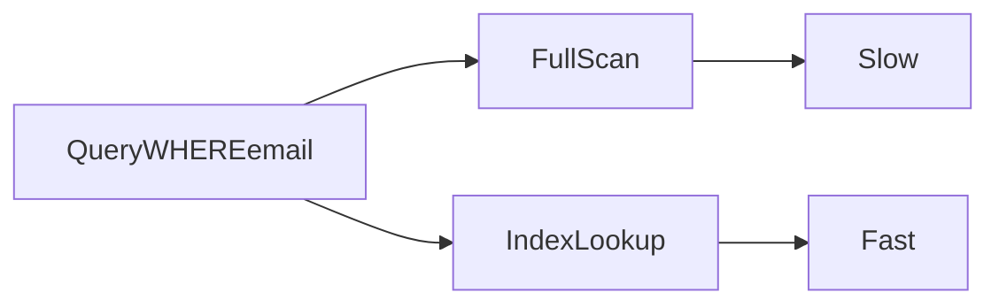

# Lesson 1: Indexes (Long-form Enhanced)

> Indexes are one of the highest-leverage performance tools in relational databases. This lesson focuses on picking the *right* indexes for real query patterns and understanding the trade-offs (writes/storage).

## Table of Contents

- What indexes are (and the read/write trade-off)
- When to index (and when not to)
- Prisma index definitions (single/composite/unique)
- Composite index order and query patterns
- Best practices, pitfalls, troubleshooting
- Advanced patterns (preview): partial indexes, EXPLAIN, covering indexes

## Learning Objectives

By the end of this lesson, you will be able to:
- Explain what an index is and why it improves query performance
- Identify which columns should be indexed (and which shouldn’t)
- Define indexes in Prisma schema (single, composite, unique)
- Understand trade-offs: faster reads vs slower writes + extra storage
- Recognize common pitfalls (too many indexes, wrong column order in composite indexes)

## Why Indexes Matter

Indexes are one of the biggest levers for database performance.

Without an index, a query often scans many rows:
- slow for large tables
- increases CPU and IO

With an index, the DB can locate rows quickly.



## What are Indexes?

An index is a data structure that helps the database find rows faster (similar to an index in a book).

Common effects:
- **faster reads** for filtered/sorted queries
- **slower writes** because indexes must be updated on insert/update/delete
- **more storage** used on disk

## Creating Indexes (Prisma)

```prisma
model User {
  id    Int    @id @default(autoincrement())
  email String @unique
  name  String

  @@index([name])
  @@index([email, name]) // composite index
}
```

### Note about `@unique`

`email String @unique` creates a unique constraint and typically an underlying unique index.
You usually don’t need an additional `@@index([email])` if it’s already unique.

## When to Use Indexes

Good candidates:
- columns used frequently in `WHERE`
- foreign keys (`userId` in `Post`)
- columns used in joins
- columns used in `ORDER BY` (especially combined with filters)

Bad candidates:
- tiny tables (no benefit)
- high-write tables where you add too many indexes (writes slow down)
- low-selectivity columns (e.g., `active` boolean) unless used in a composite index

## Index Types (Conceptually)

- **Single column**: `@@index([name])`
- **Composite**: `@@index([email, name])`
- **Unique**: `@unique` (enforces uniqueness)

## Composite Index Order Matters

For `@@index([email, name])`, the order is important.

Rule of thumb:
- put the most selective filter first (often)
- match common query patterns

Example queries helped by `@@index([published, createdAt])`:
- `WHERE published = true ORDER BY createdAt DESC`

## Real-World Scenario: Posts Feed

If your app frequently queries:
- published posts
- ordered by created date

You likely want:
- an index that supports that filter + sort

## Best Practices

### 1) Measure with real queries

Add indexes based on how your app actually queries, not guesses.

### 2) Keep indexes minimal

Every index has a write/storage cost.

### 3) Index foreign keys

This is almost always a good baseline for relational integrity + join performance.

## Common Pitfalls and Solutions

### Pitfall 1: Adding too many indexes

**Problem:** Writes slow down and migrations become heavier.

**Solution:** add only the indexes your critical queries need.

### Pitfall 2: Wrong composite index order

**Problem:** Index exists but query is still slow.

**Solution:** align index column order with your common `WHERE` + `ORDER BY` patterns.

### Pitfall 3: Indexing low-selectivity columns alone

**Problem:** `@@index([active])` often doesn’t help much.

**Solution:** include low-selectivity fields inside composite indexes with other fields.

## Troubleshooting

### Issue: Query is still slow after adding an index

**Symptoms:**
- latency doesn’t improve

**Solutions:**
1. Verify the query matches the index pattern (filters + ordering).
2. Add a composite index if filtering + sorting together.
3. Inspect query plans in Postgres (advanced).

## Advanced Patterns (Preview)

### 1) `EXPLAIN` / query plans (concept)

Indexes help only if the planner uses them. `EXPLAIN` shows whether Postgres is doing an index scan or a sequential scan.

### 2) Partial indexes (concept)

Sometimes you only query a subset (e.g., published posts). A partial index can target that subset to reduce index size and improve performance.

### 3) Covering indexes (concept)

In some cases, an index can satisfy a query without hitting the table heap for additional columns (advanced, highly workload-specific).

## Next Steps

Now that you understand indexes:

1. ✅ **Practice**: Identify top 3 slow queries and propose indexes
2. ✅ **Experiment**: Add a composite index that matches a real query pattern
3. 📖 **Next Lesson**: Learn about [Constraints](./lesson-02-constraints.md)
4. 💻 **Complete Exercises**: Work through [Exercises 06](./exercises-06.md)

## Additional Resources

- [PostgreSQL: Indexes](https://www.postgresql.org/docs/current/indexes.html)
- [Prisma Schema: Indexes](https://www.prisma.io/docs/reference/api-reference/prisma-schema-reference#index)

---

**Key Takeaways:**
- Indexes speed up reads but slow down writes and use storage.
- Index columns you filter/join/sort by frequently.
- Composite index order matters; match real query patterns.
- Prefer a small set of high-value indexes over “index everything”.
