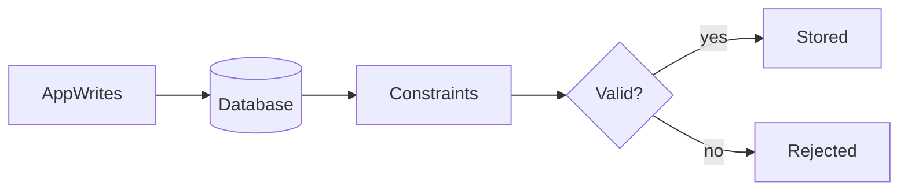

# Lesson 2: Constraints (Long-form Enhanced)

> Constraints are the database’s guardrails. They prevent invalid states even when application code is buggy, multiple services write concurrently, or someone runs manual SQL.

## Table of Contents

- Primary keys and identity
- Uniqueness (single and composite)
- Foreign keys and referential integrity
- Check constraints (concept)
- Best practices, pitfalls, troubleshooting
- Advanced patterns (preview): partial uniqueness, deferrable constraints, soft delete constraints

## Learning Objectives

By the end of this lesson, you will be able to:
- Explain what constraints are and why they protect data integrity
- Use primary keys and unique constraints appropriately
- Understand foreign keys and referential integrity
- Understand check constraints and when they’re useful
- Recognize common pitfalls (enforcing rules only in app code, missing FKs, accidental duplicates)

## Why Constraints Matter

Constraints are guardrails at the database level.

They prevent invalid states even if:
- a buggy app version writes bad data
- multiple services write to the same DB
- a manual SQL script makes a mistake



## Primary Key (PK)

A primary key uniquely identifies each row.

```prisma
model User {
  id Int @id @default(autoincrement())
}
```

### Why this matters

You need stable identifiers for:
- joins
- updates/deletes
- referencing rows from other tables

## Unique Constraint

Unique constraints enforce “no duplicates” for a field or field combination.

```prisma
model User {
  id    Int    @id @default(autoincrement())
  email String @unique
}
```

### Composite uniqueness

You can enforce uniqueness across multiple fields:

```prisma
model Membership {
  userId Int
  teamId Int

  @@unique([userId, teamId])
}
```

## Foreign Keys (FK) and Referential Integrity

Foreign keys enforce valid relationships between tables.

```prisma
model Post {
  id     Int  @id @default(autoincrement())
  userId Int
  user   User @relation(fields: [userId], references: [id])
}
```

### What this guarantees

You cannot create a post referencing a user that doesn’t exist (assuming the FK is enforced).

This prevents “orphaned rows”.

## Check Constraints

Check constraints enforce a boolean condition at the DB level.

```prisma
model User {
  id  Int @id @default(autoincrement())
  age Int

  @@check(age >= 0, name: "age_positive")
}
```

### Note

Support for check constraints can vary by Prisma version and database provider.
The concept is still important: enforce invariants in the DB when appropriate.

## Real-World Scenario: Preventing Invalid States

Examples of rules that should be constraints:
- email must be unique
- foreign keys must reference real records
- ages must be non-negative

If you rely only on app-level validation, bad writes can slip through under bugs or direct DB writes.

## Best Practices

### 1) Enforce critical business invariants in the database

Uniqueness, referential integrity, and basic checks prevent many classes of bugs.

### 2) Validate at both layers

- app validation for good UX (clear error messages)
- DB constraints for hard integrity guarantees

### 3) Plan constraints in phases for existing data

Adding NOT NULL/unique constraints can fail if existing rows violate them.
Often you need: add field → backfill → enforce constraint.

## Common Pitfalls and Solutions

### Pitfall 1: No unique constraints

**Problem:** duplicates appear over time.

**Solution:** add `@unique`/`@@unique` for fields that must be unique.

### Pitfall 2: Missing foreign keys

**Problem:** orphaned rows create confusing bugs and broken joins.

**Solution:** model relations with FKs and apply migrations consistently.

### Pitfall 3: Constraints added without cleaning existing data

**Problem:** migration fails or app breaks.

**Solution:** backfill/cleanup first, then enforce constraints.

## Troubleshooting

### Issue: Writes fail after adding constraints

**Symptoms:**
- create/update now throws DB errors

**Solutions:**
1. Identify which constraint is violated (unique, FK, check).
2. Fix validation in app layer to prevent invalid requests.
3. Clean up existing DB data if needed.

## Advanced Patterns (Preview)

### 1) Partial uniqueness (concept)

Some designs need “unique among active rows” (common with soft deletes). In Postgres this is often done with partial unique indexes (advanced).

### 2) Deferrable constraints (concept)

In some workflows you want constraints checked at transaction commit rather than per statement. This is advanced but useful in certain data migrations.

### 3) Constraints + soft deletes

Soft deletes complicate uniqueness. Plan how uniqueness should behave for deleted rows (often: allow reuse after delete, but keep history).

## Next Steps

Now that you understand constraints:

1. ✅ **Practice**: Add a unique constraint and handle 409 conflicts in your API
2. ✅ **Experiment**: Add a check constraint for a numeric field
3. 📖 **Next Lesson**: Learn about [Optimization](./lesson-03-optimization.md)
4. 💻 **Complete Exercises**: Work through [Exercises 06](./exercises-06.md)

## Additional Resources

- [PostgreSQL: Constraints](https://www.postgresql.org/docs/current/ddl-constraints.html)
- [Prisma Schema Reference](https://www.prisma.io/docs/reference/api-reference/prisma-schema-reference)

---

**Key Takeaways:**
- Constraints enforce data integrity at the database level.
- Use PKs for identity, unique constraints for “no duplicates”, and FKs for relationships.
- Validate in app code for UX, but rely on DB constraints for hard guarantees.
