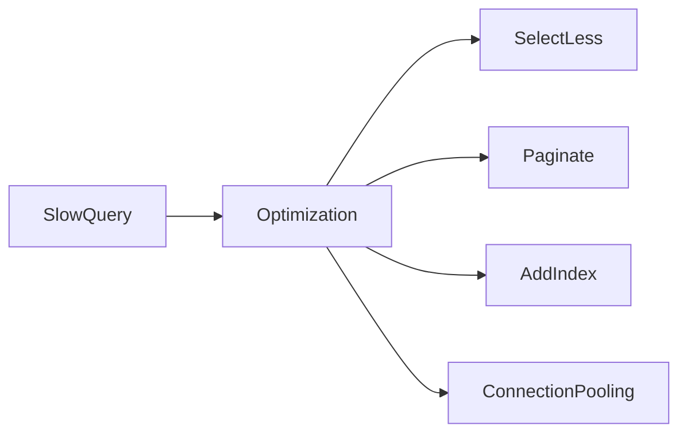

# Lesson 3: Optimization (Long-form Enhanced)

> Most database “optimization” is simple discipline: return less data, paginate, avoid N+1, and match indexes to real query patterns. This lesson focuses on the highest-impact levers and when to reach for deeper tools.

## Table of Contents

- High-impact wins (select less, paginate)
- Indexes that match query patterns
- Avoiding N+1 and accidental overfetching
- Connection pooling (high-level)
- Best practices, pitfalls, troubleshooting
- Advanced patterns (preview): EXPLAIN ANALYZE, query logging, caching boundaries

## Learning Objectives

By the end of this lesson, you will be able to:
- Optimize queries by selecting only needed fields and paginating results
- Understand how indexes support query patterns (filter + sort)
- Recognize common performance anti-patterns (unbounded queries, overfetching, N+1)
- Understand connection pooling at a high level (why it matters in production)
- Know when to profile and inspect query plans (advanced)

## Why Database Optimization Matters

Databases often become the bottleneck as your app grows.

Most performance wins come from:
- reducing the amount of data read/returned
- using indexes that match query patterns
- avoiding inefficient query patterns
- managing connections safely under load



## Query Optimization (Prisma)

### Select only needed fields

```typescript
const users = await prisma.user.findMany({
  select: {
    id: true,
    email: true,
  },
});
```

Selecting fewer fields:
- reduces payload size
- reduces serialization cost
- can reduce IO (especially with wide tables)

### Use pagination

```typescript
const users = await prisma.user.findMany({
  orderBy: { id: "asc" },
  take: 20,
  skip: 0,
});
```

Unbounded list queries are a common production incident cause.

### Avoid N+1 patterns

Don’t loop and query per row. Prefer relation queries (`include/select`) designed intentionally.

## Index Optimization (Match Query Patterns)

Add indexes for frequently queried fields:

```prisma
model Post {
  id        Int      @id @default(autoincrement())
  title     String
  published Boolean
  createdAt DateTime

  @@index([published, createdAt])
}
```

### Why this index helps

It supports queries like:
- `WHERE published = true ORDER BY createdAt DESC`

## Connection Pooling (Conceptual)

Apps open DB connections; databases can only handle so many concurrent connections.

In production you often use:
- a pooler (built-in driver pooling, or external like PgBouncer)
- a singleton Prisma Client instance per app process

Prisma Client configuration example:

```typescript
import { PrismaClient } from "@prisma/client";

const prisma = new PrismaClient({
  datasources: {
    db: {
      url: process.env.DATABASE_URL,
    },
  },
});
```

### Key idea

Avoid creating a new Prisma Client per request; that can create too many connections.

## Real-World Scenario: “Slow Users List” Endpoint

Common fixes:
- add pagination + stable ordering
- filter by relevant fields
- select only needed columns
- add index on filter/sort fields

## Best Practices

### 1) Start with high-impact wins

- paginate
- select fewer fields
- avoid N+1

### 2) Add indexes based on real queries

Indexing everything is not a strategy—measure and target.

### 3) Keep connection usage under control

Use singleton clients and pooling strategies appropriate to your deployment.

## Common Pitfalls and Solutions

### Pitfall 1: Fetching too much data

**Problem:** `findMany()` without pagination and `select`.

**Solution:** paginate + select.

### Pitfall 2: Adding the wrong index

**Problem:** index exists but query remains slow.

**Solution:** match index to the actual query pattern (filter + sort).

### Pitfall 3: Too many DB connections

**Problem:** “too many connections” errors under load.

**Solution:** singleton Prisma Client + pooling; avoid per-request client creation.

## Troubleshooting

### Issue: Query is slow only in production

**Symptoms:**
- dev is fast; prod is slow

**Solutions:**
1. Production has more data—add indexes and pagination.
2. Inspect query logs (carefully) and measure hot endpoints.

### Issue: Timeouts during high traffic

**Symptoms:**
- DB timeouts or connection errors

**Solutions:**
1. Reduce query cost (select less, paginate).
2. Add caching at the application layer (later course).
3. Use connection pooling and scale DB appropriately.

## Advanced Patterns (Preview)

### 1) `EXPLAIN ANALYZE` (concept)

`EXPLAIN` tells you the plan; `EXPLAIN ANALYZE` tells you what actually happened (time, rows).
This is the backbone of real performance debugging.

### 2) Query logging and observability (concept)

You often need:
- slow query logs (DB side)
- request tracing (app side)
so you can correlate “endpoint is slow” → “this query is slow”.

### 3) Caching boundaries (concept)

Caching can hide DB load, but it adds consistency complexity. Use it intentionally (covered in the caching course).

## Next Steps

Now that you understand optimization levers:

1. ✅ **Practice**: Add `select` and pagination to a list query
2. ✅ **Experiment**: Create an index that matches your most common filter + sort
3. 📖 **Next**: Finish the database course, then proceed to infrastructure
4. 💻 **Complete Exercises**: Work through [Exercises 06](./exercises-06.md)

## Additional Resources

- [PostgreSQL: Performance Tips](https://www.postgresql.org/docs/current/performance-tips.html)
- [Prisma: Query optimization](https://www.prisma.io/docs/concepts/components/prisma-client/performance-and-optimization)

---

**Key Takeaways:**
- Optimize by selecting less, paginating, and avoiding N+1 queries.
- Indexes must match real query patterns to help.
- Manage connections carefully (singleton client + pooling) to avoid outages.
